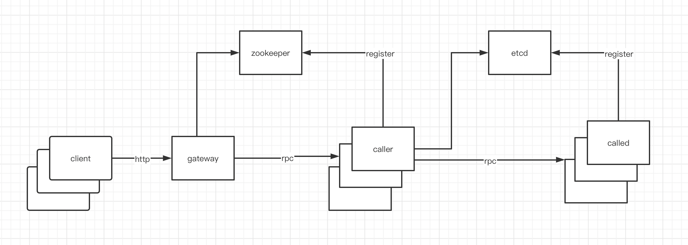

# profile
a small distributed system by rpcx.

# using

1. run any number of `called` by `./called -addr localhost:897x`
2. run any number of `caller` by `./caller -addr localhost:896x`
3. run one `gateway`
4. run `client`

# dependency
zookeeper/etcd/redis

